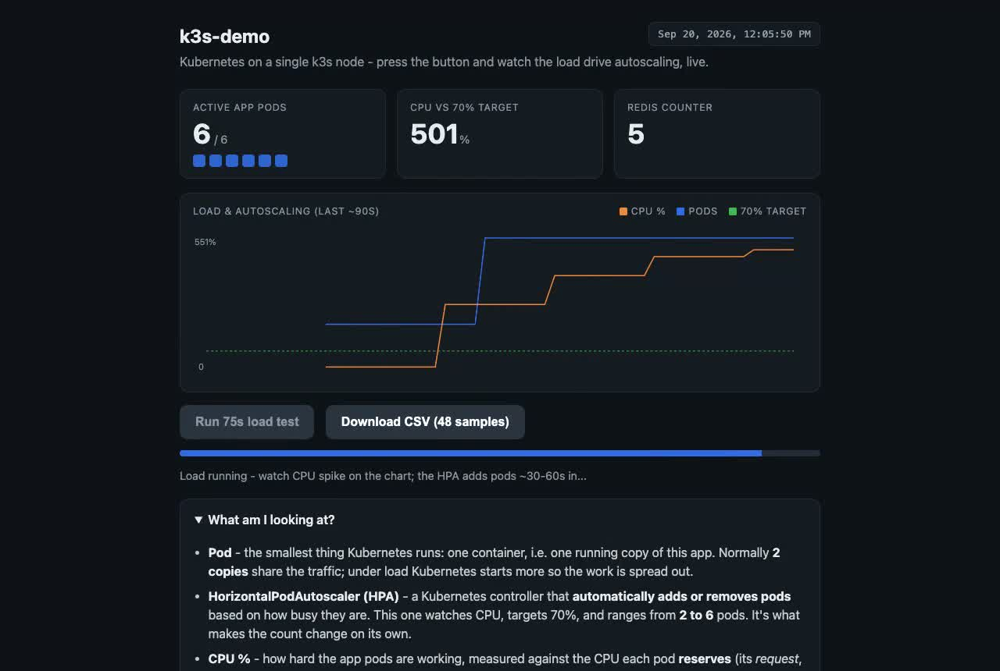

# k3s-demo

A small, containerized HTTP service and the Kubernetes manifests to run it on
k3s - built as a deliberate, self-contained Kubernetes exercise.

**Demo (recorded):** press *Run load test* and watch CPU% spike past the HPA's 70%
target while the pod count scales 2 → 6, then CPU drop as load ends. Glossary of
pod / HPA / CPU / Redis is on the same page.

[](docs/hpa-demo.mp4)

[Watch the 2m49s recording](docs/hpa-demo.mp4) — captured 2026-09-20 from the live
cluster immediately before the dedicated AWS node was torn down. There is no
public URL anymore; run it yourself with the steps below (k3d or k3s).

CPU% and replica counts are read from the HPA through the in-cluster Kubernetes
API (a ServiceAccount with read-only RBAC); the active-pod count comes from Redis.
`/info` is JSON status, `/count` the shared counter. The service is Go - a single
static binary in a `FROM scratch` image (10.9MB, ~4MiB idle; it replaced the
original Python/FastAPI service, 234MB, ~38MiB, same endpoints and page). The
`overlays/live` kustomize overlay is the hostname + TLS variant that used to be
deployed (cert-manager + Let's Encrypt on a single-node k3s).

It is intentionally **not** how I run production. My production fleet is ~70
hostnames on a single VPS as systemd units behind Apache, where an orchestrator
would add control-plane, networking, and state complexity to replace things that
already work in a line of unit file (the reasoning is its own write-up). This repo
is the separate "here is me operating Kubernetes" artifact: the app is trivial on
purpose so the manifests and operational concerns are the subject.

## What it demonstrates

| Concern | Where | What it shows |
|--------|-------|---------------|
| Container hygiene | `Dockerfile` | multi-stage build to a static Go binary in a `FROM scratch` image - no shell, interpreter, or libc to attack. 10.9MB image / ~4MiB idle RSS, measured against the Python/FastAPI original it replaced (234MB / ~38MiB) |
| Workload + rollout | `k8s/deployment.yaml` | replicas, `RollingUpdate` with `maxUnavailable: 0`, `revisionHistoryLimit` |
| Health gating | deployment probes + `main.go` | liveness (`/healthz`) vs readiness (`/readyz`, gated 2s so rollouts are observable) |
| Resource governance | deployment `resources` | CPU/memory requests and limits |
| Pod hardening | deployment `securityContext` | `runAsNonRoot`, `readOnlyRootFilesystem`, drop all caps, seccomp `RuntimeDefault` |
| Config vs secret | `configmap.yaml`, `secret.yaml` | non-secret config and secret injected via `envFrom`, kept separate |
| Service + ingress | `service.yaml`, `ingress.yaml` | ClusterIP + Traefik ingress (k3s default) |
| Autoscaling | `hpa.yaml` + `/burn` endpoint | HPA v2 on CPU, 2->6 replicas, with a way to generate load |
| Stateful backing service | `redis.yaml` + `/count` endpoint | Redis as a StatefulSet with a per-pod PVC and a headless Service; the app reaches it by DNS and shares a counter across all app pods |
| Namespacing + overlays | `namespace.yaml`, `kustomization.yaml` | isolation in its own namespace; image tag pinned via kustomize |
| Policy as code | `policy/` | the hardening above made *enforced at admission* — OPA/Gatekeeper (Rego) for the five-rule set, plus a built-in ValidatingAdmissionPolicy (CEL) re-expressing one rule to show the engine tradeoff. See [`policy/README.md`](policy/README.md) |

It's a two-tier app on purpose: a stateless web Deployment in front of a stateful
Redis StatefulSet, so the manifests cover both halves a real service has.

## Run it on k3s

```bash
# 1. A cluster. Locally, k3d gives a real (optionally multi-node) cluster:
k3d cluster create demo
# (or a k3s node: curl -sfL https://get.k3s.io | sh -)

# 2. Build and load the image (k3d):
docker build -t ghcr.io/jacobstephens2/k3s-demo:1.0.0 .
k3d image import ghcr.io/jacobstephens2/k3s-demo:1.0.0 -c demo

# 3. Apply:
kubectl apply -k k8s/

# 4. Reach it (Traefik ingress):
echo "127.0.0.1 k3s-demo.localhost" | sudo tee -a /etc/hosts
curl http://k3s-demo.localhost/        # JSON: pod name, version, config, secret_loaded
curl http://k3s-demo.localhost/count   # Redis-backed counter, shared across app pods

# 5. Watch the HPA react to load (needs metrics-server, bundled with k3s):
kubectl -n k3s-demo get hpa -w &
hey -z 60s http://k3s-demo.localhost/burn?ms=500
```

`kubectl -n k3s-demo rollout restart deploy/k3s-demo` shows the zero-downtime
rolling update; `kubectl -n k3s-demo get pods -w` shows readiness gating traffic.

## Validation status

The manifests are validated **statically** in CI - `kubectl kustomize k8s` rendered
and checked against the Kubernetes schemas with `kubeconform -strict`. The `policy/`
manifests are validated too, with `-ignore-missing-schemas` so the Gatekeeper CRDs
(ConstraintTemplate, the generated constraint kinds) are skipped while the standard
kinds, including the ValidatingAdmissionPolicy, are still checked. They are not
applied to any production cluster from here; run them on your own k3s/k3d as above.
